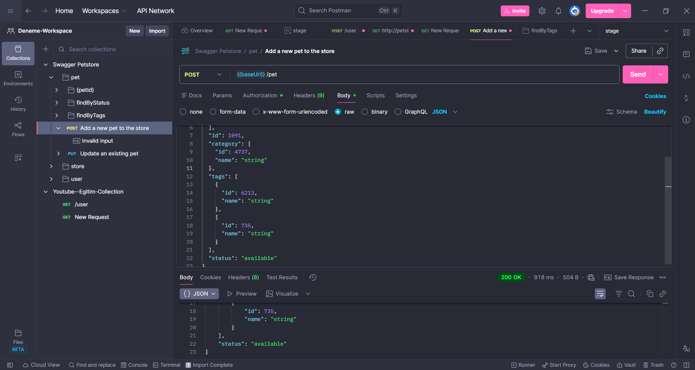
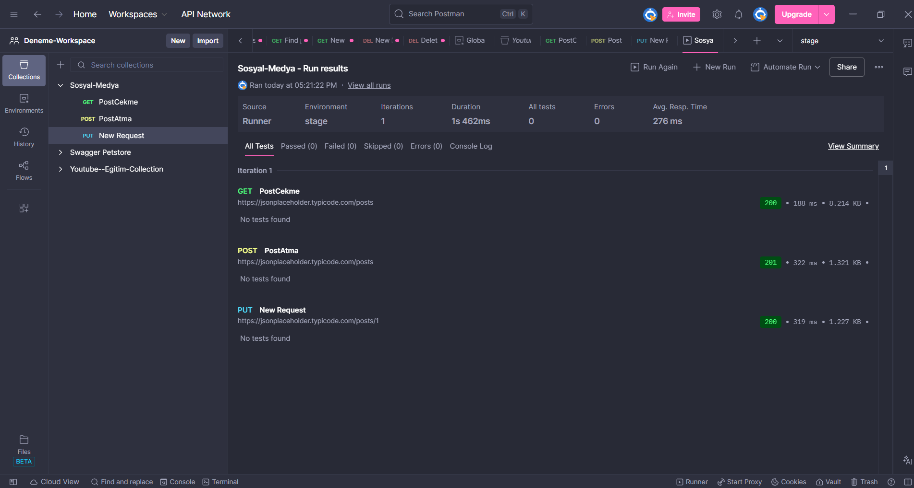

# 🚀 Postman ile API Testi ve Otomasyon Yolculuğu

Bu repository (depo), **Postman** kullanarak gerçekleştirdiğim **API Testi** ve **Test Otomasyonu** çalışmalarımı belgelemektedir. CRUD işlemlerini yönetme, HTTP yanıtlarını doğrulama ve test senaryolarını otomatize etme yetkinliklerimi gösteren kişisel bir portfolyo çalışmasıdır.

## 🛠️ Araçlar ve Teknolojiler
* **Araç:** Postman (v10+)
* **Metodoloji:** REST API Testi
* **Veri Formatı:** JSON
* **Temel Kavramlar:** CRUD İşlemleri, HTTP Durum Kodları, Collection Runner (Otomasyon)
* **Kullanılan Test API'ları:** [JSONPlaceholder](https://jsonplaceholder.typicode.com/), [ReqRes](https://reqres.in/), [Swagger Petstore](https://petstore.swagger.io/)

## 📂 Dosya Yapısı
* ` /Postman-API--Eğitim-Dökümanı` - Öğrenme sürecimde aldığım kişisel notlar ve eğitim materyalleri.
* ` /Ekran_Goruntuleri ` - Başarılı test koşumlarına ait kanıt niteliğindeki görseller.
* ` /Collections ` - Dışa aktarılmış (Export) Postman .json dosyaları (İndirip deneyebilirsiniz).

## 🎯 Kazanımlar ve Yaptığım İşlemler

### 1. Fonksiyonel Testler (CRUD Döngüsü)
API yaşam döngüsündeki temel istekleri başarıyla uyguladım ve doğruladım:
* ✅ **GET (Veri Çekme):** Sunucudan veri okuma işlemleri (Örn: Kullanıcı listesini getirme).
* ✅ **POST (Veri Oluşturma):** Sunucuya veri göndererek yeni kayıt açma (Örn: Yeni blog yazısı paylaşma).
* ✅ **PUT (Güncelleme):** Mevcut veriyi değiştirme ve düzenleme.
* ✅ **DELETE (Silme):** Sunucudan veri kaldırma işlemleri.

### 2. Yanıt Doğrulama (Response Validation)
* **HTTP Status Kodları** kontrol edildi (200 OK, 201 Created, 204 No Content, 404 Not Found vb.).
* **JSON Response Body** analizi yapılarak dönen verinin doğruluğu test edildi.

### 3. Test Otomasyonu (Collection Runner)
* Tekil istekler **Postman Collections** altında gruplandı.
* **Collection Runner** kullanılarak test setleri toplu halde (Batch) çalıştırıldı.
* Senaryolarda **%100 Başarı (Pass)** oranı yakalandı.

## 📸 Çalışma Kanıtları (Proof of Work)
*(Testlerime ait örnek ekran görüntüleri aşağıdadır)*

> **Senaryo 1:** POST isteği ile başarılı bir şekilde yeni kayıt oluşturulması.
> 

> **Senaryo 2:** Collection Runner ile Otomatik Test Sonuçları.
> 

## 👨‍💻 Hakkımda
Merhaba, ben **İbrahim Türkyılmaz**. FinTech, Veri Analitiği ve Yazılım Kalite Güvencesi (QA) alanlarına odaklanmış bir Endüstri Mühendisliği öğrencisiyim. Teknik yetkinliklerimi SQL, API Test Otomasyonu ve Süreç Yönetimi araçlarıyla geliştirmeye devam ediyorum.

---
*Benimle bağlantı kurmak için: [LinkedIn Profilim](https://www.linkedin.com/in/ibrahim-turkyilmaz-68a188253/)*