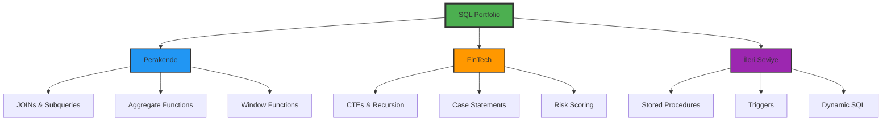

# 📂 Projeler, Sorguları ve Scriptleri

<div align="center">


**Gerçek Veri Setleri ile SQL Analiz Projeleri**

</div>

---

## 📋 İçindekiler

- [🏪 Perakende \& E-Ticaret](#-perakende--e-ticaret)
- [💳 FinTech \& InsurTech](#-fintech--insurtech)
- [🚀 İleri Seviye SQL](#-i̇leri-seviye-sql)
- [📊 Veri Setleri](#-veri-setleri)
- [🛠️ Kullanılan Teknikler](#-kullanılan-teknikler)

---

## 🗂️ Klasör Yapısı

```
Projeler_Sorguları_Scriptleri/
│
├── 🏪 Perakende-Store/
│   ├── E-Ticaret-Veritabani/
│   │   ├── 01_Schema_Design.sql
│   │   ├── 02_Insert_Data.sql
│   │   └── 03_Business_Queries.sql
│   │
│   └── Superstore-Analiz/
│       ├── 01_Data_Exploration.sql
│       ├── 02_Profitability_Analysis.sql
│       └── 03_Regional_Performance.sql
│
├── 💳 FinTech & InsurTech/
│   ├── Banking-Churn-Analysis/
│   │   ├── 01_Data_Preparation.sql
│   │   ├── 02_Churn_Segmentation.sql
│   │   └── 03_Retention_Strategies.sql
│   │
│   └── Insurance-Fraud-Detection/
│       ├── 01_Claims_Analysis.sql
│       └── 02_Fraud_Patterns.sql
│
└── 🚀 Ileri-Seviye/
    ├── Window-Functions/
    ├── CTEs-Recursive/
    ├── Stored-Procedures/
    └── Dynamic-SQL/
```

---

## 🏪 Perakende & E-Ticaret

### 📦 Proje 1: E-Ticaret Veritabanı Mimarisi

<details>
<summary><b>🎯 Proje Özeti (Detaylar için tıklayın)</b></summary>

#### İş Problemi
Bir e-ticaret platformu için sıfırdan veritabanı tasarımı ve işletilmesi.

#### Çözüm Yaklaşımı
1. **Gereksinim Analizi**: İş kurallarının belirlenmesi
2. **ER Modelleme**: Varlık-ilişki diyagramının oluşturulması
3. **Normalizasyon**: 3NF'ye kadar normalizasyon
4. **Implementasyon**: T-SQL ile tablo oluşturma
5. **Test & Validasyon**: Veri bütünlüğü testleri

#### Teknik Detaylar

**Veritabanı Şeması:**
```sql
-- Müşteriler Tablosu
CREATE TABLE Customers (
    CustomerID INT PRIMARY KEY IDENTITY(1,1),
    FirstName NVARCHAR(50) NOT NULL,
    LastName NVARCHAR(50) NOT NULL,
    Email NVARCHAR(100) UNIQUE NOT NULL,
    Phone NVARCHAR(20),
    RegistrationDate DATETIME DEFAULT GETDATE(),
    IsActive BIT DEFAULT 1
);

-- Kategoriler Tablosu
CREATE TABLE Categories (
    CategoryID INT PRIMARY KEY IDENTITY(1,1),
    CategoryName NVARCHAR(100) NOT NULL,
    Description NVARCHAR(MAX),
    ParentCategoryID INT NULL,
    FOREIGN KEY (ParentCategoryID) REFERENCES Categories(CategoryID)
);

-- Ürünler Tablosu
CREATE TABLE Products (
    ProductID INT PRIMARY KEY IDENTITY(1,1),
    ProductName NVARCHAR(200) NOT NULL,
    CategoryID INT NOT NULL,
    UnitPrice DECIMAL(10,2) NOT NULL CHECK (UnitPrice >= 0),
    UnitsInStock INT NOT NULL DEFAULT 0 CHECK (UnitsInStock >= 0),
    ReorderLevel INT DEFAULT 10,
    Discontinued BIT DEFAULT 0,
    FOREIGN KEY (CategoryID) REFERENCES Categories(CategoryID)
);

-- Siparişler Tablosu
CREATE TABLE Orders (
    OrderID INT PRIMARY KEY IDENTITY(1,1),
    CustomerID INT NOT NULL,
    OrderDate DATETIME DEFAULT GETDATE(),
    ShippedDate DATETIME NULL,
    ShipAddress NVARCHAR(200),
    ShipCity NVARCHAR(50),
    ShipPostalCode NVARCHAR(10),
    OrderStatus NVARCHAR(20) DEFAULT 'Pending',
    TotalAmount DECIMAL(12,2),
    FOREIGN KEY (CustomerID) REFERENCES Customers(CustomerID),
    CONSTRAINT CHK_ShippedDate CHECK (ShippedDate >= OrderDate)
);

-- Sipariş Detayları
CREATE TABLE OrderDetails (
    OrderDetailID INT PRIMARY KEY IDENTITY(1,1),
    OrderID INT NOT NULL,
    ProductID INT NOT NULL,
    Quantity INT NOT NULL CHECK (Quantity > 0),
    UnitPrice DECIMAL(10,2) NOT NULL,
    Discount DECIMAL(4,2) DEFAULT 0 CHECK (Discount BETWEEN 0 AND 1),
    FOREIGN KEY (OrderID) REFERENCES Orders(OrderID),
    FOREIGN KEY (ProductID) REFERENCES Products(ProductID)
);
```

#### İş Analizi Sorguları

**1. En Çok Satan Ürünler**
```sql
SELECT TOP 10
    p.ProductName,
    c.CategoryName,
    SUM(od.Quantity) AS ToplamSatilanMiktar,
    SUM(od.Quantity * od.UnitPrice * (1 - od.Discount)) AS ToplamGelir,
    COUNT(DISTINCT o.CustomerID) AS BenzersizMusteri
FROM OrderDetails od
JOIN Products p ON od.ProductID = p.ProductID
JOIN Categories c ON p.CategoryID = c.CategoryID
JOIN Orders o ON od.OrderID = o.OrderID
WHERE o.OrderDate >= DATEADD(MONTH, -6, GETDATE())
GROUP BY p.ProductName, c.CategoryName
ORDER BY ToplamGelir DESC;
```

**2. Müşteri Segmentasyonu (RFM Analizi)**
```sql
WITH MusteriMetrikleri AS (
    SELECT 
        c.CustomerID,
        c.FirstName + ' ' + c.LastName AS MusteriAdi,
        -- Recency: Son sipariş üzerinden geçen gün sayısı
        DATEDIFF(DAY, MAX(o.OrderDate), GETDATE()) AS SonSiparisGun,
        -- Frequency: Toplam sipariş sayısı
        COUNT(DISTINCT o.OrderID) AS ToplamSiparis,
        -- Monetary: Toplam harcama
        SUM(o.TotalAmount) AS ToplamHarcama
    FROM Customers c
    LEFT JOIN Orders o ON c.CustomerID = o.CustomerID
    WHERE c.IsActive = 1
    GROUP BY c.CustomerID, c.FirstName, c.LastName
),
RFMSkorlar AS (
    SELECT 
        *,
        NTILE(5) OVER (ORDER BY SonSiparisGun ASC) AS R_Score,
        NTILE(5) OVER (ORDER BY ToplamSiparis DESC) AS F_Score,
        NTILE(5) OVER (ORDER BY ToplamHarcama DESC) AS M_Score
    FROM MusteriMetrikleri
)
SELECT 
    *,
    CASE 
        WHEN R_Score >= 4 AND F_Score >= 4 AND M_Score >= 4 THEN 'VIP - Şampiyonlar'
        WHEN R_Score >= 3 AND F_Score >= 3 AND M_Score >= 3 THEN 'Sadık Müşteriler'
        WHEN R_Score >= 4 AND F_Score <= 2 THEN 'Yeni Müşteriler'
        WHEN R_Score <= 2 AND F_Score >= 3 THEN 'Risk Altındaki Sadıklar'
        WHEN R_Score <= 2 AND F_Score <= 2 THEN 'Kayıp Müşteriler'
        ELSE 'Potansiyel Sadıklar'
    END AS MusteriSegmenti
FROM RFMSkorlar
ORDER BY M_Score DESC, F_Score DESC, R_Score DESC;
```

**3. Stok Yönetimi - Yeniden Sipariş Uyarıları**
```sql
SELECT 
    p.ProductID,
    p.ProductName,
    c.CategoryName,
    p.UnitsInStock AS MevcutStok,
    p.ReorderLevel AS YenidenSiparisSeviyes,
    -- Son 30 günlük ortalama satış
    ISNULL(AVG(od.Quantity), 0) AS OrtalamaSatis,
    -- Tahmini tükenme süresi (gün)
    CASE 
        WHEN AVG(od.Quantity) > 0 THEN 
            CEILING(p.UnitsInStock / AVG(od.Quantity))
        ELSE 999
    END AS TahminiTukenmeSuresi,
    CASE 
        WHEN p.UnitsInStock < p.ReorderLevel THEN '🔴 ACIL - Sipariş Ver'
        WHEN p.UnitsInStock < (p.ReorderLevel * 1.5) THEN '🟡 DİKKAT - Yakında Tükenecek'
        ELSE '🟢 YETERLİ'
    END AS StokDurumu
FROM Products p
JOIN Categories c ON p.CategoryID = c.CategoryID
LEFT JOIN OrderDetails od ON p.ProductID = od.ProductID
LEFT JOIN Orders o ON od.OrderID = o.OrderID 
    AND o.OrderDate >= DATEADD(DAY, -30, GETDATE())
WHERE p.Discontinued = 0
GROUP BY 
    p.ProductID, 
    p.ProductName, 
    c.CategoryName, 
    p.UnitsInStock, 
    p.ReorderLevel
HAVING p.UnitsInStock < p.ReorderLevel * 2
ORDER BY 
    CASE 
        WHEN p.UnitsInStock < p.ReorderLevel THEN 1
        WHEN p.UnitsInStock < (p.ReorderLevel * 1.5) THEN 2
        ELSE 3
    END,
    p.UnitsInStock ASC;
```

</details>

#### 📊 Proje Metrikleri

| Metrik | Değer |
|--------|-------|
| **Toplam Tablo** | 5 Ana + 3 Lookup |
| **İlişki Sayısı** | 7 Foreign Key |
| **Constraint** | 12 (PK, FK, CHECK, UNIQUE) |
| **Script Sayısı** | 3 (Schema, Data, Queries) |
| **Kod Satırı** | ~500 |

---

### 📉 Proje 2: Superstore Zarar Önleme Analizi

<details>
<summary><b>🎯 Proje Özeti (Detaylar için tıklayın)</b></summary>

#### İş Problemi
Global bir perakende şirketi bazı ürün kategorilerinde ve bölgelerde zarar ediyor. Hangi segmentlerin karlılığı düşürüyor?

#### Veri Seti
- **Kaynak**: Superstore Sales Dataset (Kaggle)
- **Satır Sayısı**: ~10,000
- **Sütun Sayısı**: 21
- **Kapsam**: 2014-2017 satış verileri

#### Analiz Adımları

**1. Veri Keşfi (Data Exploration)**
```sql
-- Veri setinin genel yapısı
SELECT 
    COUNT(*) AS ToplamSatir,
    COUNT(DISTINCT [Order ID]) AS BenzersizSiparis,
    COUNT(DISTINCT [Customer ID]) AS BenzersizMusteri,
    COUNT(DISTINCT [Product ID]) AS BenzersizUrun,
    MIN([Order Date]) AS IlkSiparisTarihi,
    MAX([Order Date]) AS SonSiparisTarihi
FROM Superstore;

-- Kategori bazlı dağılım
SELECT 
    Category,
    [Sub-Category],
    COUNT(*) AS SatirSayisi,
    COUNT(DISTINCT [Product ID]) AS UrunSayisi
FROM Superstore
GROUP BY Category, [Sub-Category]
ORDER BY Category, SatirSayisi DESC;
```

**2. Karlılık Analizi**
```sql
-- Kategori ve alt kategori bazlı kar/zarar analizi
WITH KategoriPerformans AS (
    SELECT 
        Category,
        [Sub-Category],
        COUNT(*) AS SatisSayisi,
        SUM(Sales) AS ToplamSatis,
        SUM(Profit) AS ToplamKar,
        AVG(Profit) AS OrtalamaKar,
        SUM(Quantity) AS ToplamMiktar,
        -- Kar marjı %
        ROUND(SUM(Profit) / NULLIF(SUM(Sales), 0) * 100, 2) AS KarMarjiYuzde,
        -- Zarar eden sipariş oranı
        ROUND(
            SUM(CASE WHEN Profit < 0 THEN 1 ELSE 0 END) * 100.0 / COUNT(*), 
            2
        ) AS ZararOrani
    FROM Superstore
    GROUP BY Category, [Sub-Category]
)
SELECT 
    *,
    CASE 
        WHEN ToplamKar < 0 THEN '🔴 ZARAR'
        WHEN KarMarjiYuzde < 5 THEN '🟡 DÜŞÜK KAR'
        WHEN KarMarjiYuzde < 15 THEN '🟢 ORTA KAR'
        ELSE '🟢 YÜKSEK KAR'
    END AS PerformansDurumu
FROM KategoriPerformans
ORDER BY ToplamKar ASC;
```

**Sonuçlar:**
| Alt Kategori | Toplam Satış | Toplam Kar | Kar Marjı % | Durum |
|--------------|--------------|------------|-------------|-------|
| Tables | $206,965 | **-$17,725** | -8.6% | 🔴 ZARAR |
| Bookcases | $114,879 | **-$3,472** | -3.0% | 🔴 ZARAR |
| Supplies | $46,673 | -$1,189 | -2.5% | 🔴 ZARAR |

**3. Bölgesel Performans**
```sql
-- Bölge ve şehir bazlı analiz
SELECT 
    Region,
    State,
    City,
    COUNT(*) AS SiparisSayisi,
    SUM(Sales) AS ToplamSatis,
    SUM(Profit) AS ToplamKar,
    ROUND(AVG(Profit), 2) AS OrtalamaKar,
    -- En çok satan kategori
    (SELECT TOP 1 Category 
     FROM Superstore s2 
     WHERE s2.Region = s1.Region AND s2.State = s1.State AND s2.City = s1.City
     GROUP BY Category 
     ORDER BY SUM(Sales) DESC) AS EnCokSatanKategori
FROM Superstore s1
GROUP BY Region, State, City
HAVING SUM(Profit) < 0
ORDER BY ToplamKar ASC;
```

**4. Müşteri Analizi**
```sql
-- Zarar ettiren müşteriler
WITH MusteriKarZarar AS (
    SELECT 
        [Customer ID],
        [Customer Name],
        COUNT(*) AS SiparisSayisi,
        SUM(Sales) AS ToplamSatis,
        SUM(Profit) AS ToplamKar,
        SUM(CASE WHEN Profit < 0 THEN 1 ELSE 0 END) AS ZararliSiparis,
        -- Favori kategori
        (SELECT TOP 1 Category 
         FROM Superstore s2 
         WHERE s2.[Customer ID] = s1.[Customer ID]
         GROUP BY Category 
         ORDER BY COUNT(*) DESC) AS FavoriKategori
    FROM Superstore s1
    GROUP BY [Customer ID], [Customer Name]
)
SELECT 
    *,
    ROUND(ZararliSiparis * 100.0 / SiparisSayisi, 2) AS ZararliSiparisOrani
FROM MusteriKarZarar
WHERE ToplamKar < 0
ORDER BY ToplamKar ASC;
```

**5. Zaman Serisi Analizi**
```sql
-- Aylık kar/zarar trendi
SELECT 
    YEAR([Order Date]) AS Yil,
    MONTH([Order Date]) AS Ay,
    DATENAME(MONTH, [Order Date]) AS AyAdi,
    COUNT(*) AS SiparisSayisi,
    SUM(Sales) AS ToplamSatis,
    SUM(Profit) AS ToplamKar,
    ROUND(SUM(Profit) / NULLIF(SUM(Sales), 0) * 100, 2) AS KarMarji,
    -- Kümülatif kar
    SUM(SUM(Profit)) OVER (
        ORDER BY YEAR([Order Date]), MONTH([Order Date])
    ) AS KumulatifKar
FROM Superstore
GROUP BY YEAR([Order Date]), MONTH([Order Date]), DATENAME(MONTH, [Order Date])
ORDER BY Yil, Ay;
```

#### 💡 İş Önerileri (Actionable Insights)

1. **🔴 Acil Aksiyonlar:**
   - **Tables** kategorisinde %15 fiyat artışı veya tedarikçi değişikliği
   - **Bookcases** için minimum sipariş miktarı belirlenmeli
   - Zarar eden şehirlerde kargo maliyetleri yeniden değerlendirilmeli

2. **🟡 Orta Vadeli:**
   - Müşteri segmentasyonu ile zarar eden müşterilere özel stratejiler
   - Discount politikasının gözden geçirilmesi
   - Mevsimsel kampanya planlaması

3. **🟢 Uzun Vadeli:**
   - Tahminleme modeli ile stok optimizasyonu
   - Yüksek karlı kategorilere yatırım
   - Bölgesel fiyatlandırma stratejisi

</details>

#### 📊 Proje Metrikleri

| Metrik | Değer |
|--------|-------|
| **Veri Satırı** | 9,994 |
| **Analiz Edilen Kategori** | 3 Ana, 17 Alt |
| **Zarar Tutarı** | -$22,386 |
| **Analiz Script** | 5 |
| **Görselleştirme** | Power BI Dashboard (Planlanan) |

---

## 💳 FinTech & InsurTech

### 🏦 Proje 3: Bankacılık - Müşteri Terk (Churn) Analizi

<details>
<summary><b>🎯 Proje Özeti (Detaylar için tıklayın)</b></summary>

#### İş Problemi
Banka müşterilerinin %20'si hesaplarını kapatıyor. Hangi müşteri segmentleri risk altında?

#### Veri Seti
- **Kaynak**: Bank Marketing Dataset (UCI ML Repository)
- **Satır Sayısı**: 45,211
- **Hedef Değişken**: Exited (0: Kaldı, 1: Ayrıldı)

#### Özellikler (Features)
```sql
-- Müşteri demografik bilgileri
SELECT 
    CustomerID,
    Age,
    Gender,
    Geography,
    -- Finansal bilgiler
    CreditScore,
    Balance,
    EstimatedSalary,
    -- Ürün kullanımı
    NumOfProducts,
    HasCrCard,
    IsActiveMember,
    -- Hedef değişken
    Exited
FROM BankChurn;
```

#### Keşifsel Veri Analizi

**1. Genel Terk Oranı**
```sql
SELECT 
    COUNT(*) AS ToplamMusteri,
    SUM(Exited) AS AyrilanMusteri,
    ROUND(SUM(Exited) * 100.0 / COUNT(*), 2) AS TerkOraniYuzde
FROM BankChurn;
-- Sonuç: %20.4 genel terk oranı
```

**2. Demografik Analiz**
```sql
-- Yaş gruplarına göre terk oranı
WITH YasGruplari AS (
    SELECT 
        CASE 
            WHEN Age < 30 THEN '18-29'
            WHEN Age < 40 THEN '30-39'
            WHEN Age < 50 THEN '40-49'
            WHEN Age < 60 THEN '50-59'
            ELSE '60+'
        END AS YasGrubu,
        Exited
    FROM BankChurn
)
SELECT 
    YasGrubu,
    COUNT(*) AS Toplam,
    SUM(Exited) AS Ayrilan,
    ROUND(AVG(CAST(Exited AS FLOAT)) * 100, 2) AS TerkOrani,
    -- Görselleştirme için bar
    REPLICATE('█', ROUND(AVG(CAST(Exited AS FLOAT)) * 100, 0) / 2) AS [Bar Chart]
FROM YasGruplari
GROUP BY YasGrubu
ORDER BY 
    CASE YasGrubu
        WHEN '18-29' THEN 1
        WHEN '30-39' THEN 2
        WHEN '40-49' THEN 3
        WHEN '50-59' THEN 4
        ELSE 5
    END;
```

**Sonuçlar:**
| Yaş Grubu | Toplam | Ayrılan | Terk Oranı % |
|-----------|--------|---------|--------------|
| 18-29 | 7,840 | 1,156 | 14.7% |
| 30-39 | 15,234 | 2,890 | 19.0% |
| 40-49 | 14,567 | 3,687 | **25.3%** 🔴 |
| 50-59 | 6,123 | 1,789 | **29.2%** 🔴 |
| 60+ | 1,447 | 688 | **47.5%** 🔴 |

**3. Coğrafi Analiz**
```sql
SELECT 
    Geography AS Ulke,
    COUNT(*) AS ToplamMusteri,
    SUM(Exited) AS AyrilanMusteri,
    ROUND(AVG(CAST(Exited AS FLOAT)) * 100, 2) AS TerkOrani,
    ROUND(AVG(Balance), 2) AS OrtalamaHesapBakiyesi,
    ROUND(AVG(CreditScore), 0) AS OrtalamaKrediSkoru
FROM BankChurn
GROUP BY Geography
ORDER BY TerkOrani DESC;
```

**4. Ürün Kullanımı vs Terk**
```sql
-- Kaç ürün kullanan müşteriler daha sadık?
SELECT 
    NumOfProducts AS UrunSayisi,
    COUNT(*) AS MusteriSayisi,
    SUM(Exited) AS Ayrilan,
    ROUND(AVG(CAST(Exited AS FLOAT)) * 100, 2) AS TerkOrani,
    ROUND(AVG(Balance), 2) AS OrtalamaBalans
FROM BankChurn
GROUP BY NumOfProducts
ORDER BY NumOfProducts;
```

**İlginç Bulgu:**
- 1 ürün kullananlar: %27.7 terk oranı
- 2 ürün kullananlar: %7.6 terk oranı ✅
- 3+ ürün: %83.3 terk oranı 🔴 (Anormal - incelenmeli)

**5. Risk Skorlama Modeli**
```sql
-- Müşterileri risk seviyelerine göre skorla
WITH MusteriRiskPuani AS (
    SELECT 
        CustomerID,
        Surname,
        -- Risk faktörleri
        CASE 
            WHEN Age >= 50 THEN 30
            WHEN Age >= 40 THEN 20
            WHEN Age >= 30 THEN 10
            ELSE 0
        END AS YasRiskPuani,
        
        CASE 
            WHEN Geography = 'Germany' THEN 20
            WHEN Geography = 'France' THEN 15
            ELSE 10
        END AS CografyaRiskPuani,
        
        CASE 
            WHEN IsActiveMember = 0 THEN 25
            ELSE 0
        END AS AktiflikRiskPuani,
        
        CASE 
            WHEN NumOfProducts = 1 THEN 20
            WHEN NumOfProducts >= 3 THEN 30
            ELSE 0
        END AS UrunRiskPuani,
        
        CASE 
            WHEN Balance = 0 THEN 15
            ELSE 0
        END AS BakiyeRiskPuani,
        
        CASE 
            WHEN CreditScore < 400 THEN 20
            WHEN CreditScore < 600 THEN 10
            ELSE 0
        END AS KrediRiskPuani,
        
        Exited
    FROM BankChurn
)
SELECT 
    CustomerID,
    Surname,
    (YasRiskPuani + CografyaRiskPuani + AktiflikRiskPuani + 
     UrunRiskPuani + BakiyeRiskPuani + KrediRiskPuani) AS ToplamRiskPuani,
    CASE 
        WHEN (YasRiskPuani + CografyaRiskPuani + AktiflikRiskPuani + 
              UrunRiskPuani + BakiyeRiskPuani + KrediRiskPuani) >= 80 THEN '🔴 ÇOK YÜKSEK RİSK'
        WHEN (YasRiskPuani + CografyaRiskPuani + AktiflikRiskPuani + 
              UrunRiskPuani + BakiyeRiskPuani + KrediRiskPuani) >= 60 THEN '🟠 YÜKSEK RİSK'
        WHEN (YasRiskPuani + CografyaRiskPuani + AktiflikRiskPuani + 
              UrunRiskPuani + BakiyeRiskPuani + KrediRiskPuani) >= 40 THEN '🟡 ORTA RİSK'
        ELSE '🟢 DÜŞÜK RİSK'
    END AS RiskSegmenti,
    Exited AS GercekTerk
FROM MusteriRiskPuani
ORDER BY ToplamRiskPuani DESC;
```

**6. Retention (Elde Tutma) Stratejileri**
```sql
-- Yüksek riskli ancak değerli müşterileri tespit et
WITH DeğerliRiskliMusteriler AS (
    SELECT 
        c.*,
        -- Müşteri yaşam boyu değeri tahmini
        (Balance * 0.02 + EstimatedSalary * 0.05) * 
        CASE WHEN Tenure > 0 THEN Tenure ELSE 1 END AS CLV_Tahmin
    FROM BankChurn c
    WHERE IsActiveMember = 0 
        OR NumOfProducts = 1
        OR Age >= 45
)
SELECT TOP 100
    CustomerID,
    Surname,
    Geography,
    Age,
    Balance,
    NumOfProducts,
    IsActiveMember,
    ROUND(CLV_Tahmin, 2) AS TahminiYasamBoyuDegeri,
    -- Önerilen aksiyon
    CASE 
        WHEN IsActiveMember = 0 AND Balance > 50000 THEN 'VIP Aktivasyon Kampanyası'
        WHEN NumOfProducts = 1 THEN 'Çapraz Satış Fırsatı'
        WHEN Age >= 60 THEN 'Emekli Müşteri Özel Programı'
        ELSE 'Genel Sadakat Kampanyası'
    END AS OnerilenStrateji
FROM DeğerliRiskliMusteriler
WHERE Exited = 0
ORDER BY CLV_Tahmin DESC;
```

#### 💡 İş Önerileri

**Öncelikli Aksiyonlar:**

1. **🎯 40+ Yaş Grubu Retention Programı**
   - Özel müşteri temsilcisi atama
   - Tercihli faiz oranları
   - Yıllık sadakat bonusu

2. **🌍 Almanya Özel Stratejisi**
   - Terk oranı en yüksek (%32.4)
   - Yerel rekabet analizi gerekli
   - Bölge özel ürün paketi

3. **📈 Çapraz Satış Kampanyası**
   - 1 ürün kullanıcılarına 2. ürün teşviki
   - İlk 3 ay ücretsiz ek hesap
   - Kombine ürün indirimleri

4. **🔔 Erken Uyarı Sistemi**
   - Risk skoru 60+ müşterilere otomatik e-posta
   - Aktivite düşen müşterilere arama
   - 3 ay işlem yapmayan hesaplar için alarm

</details>

#### 📊 Proje Metrikleri

| Metrik | Değer |
|--------|-------|
| **Veri Satırı** | 45,211 |
| **Genel Terk Oranı** | %20.4 |
| **En Riskli Segment** | 60+ yaş, %47.5 terk |
| **Model Özellikleri** | 11 özellik |
| **Risk Seviyeleri** | 4 segment |

---

### 🏥 Proje 4: Sigorta - Fraud (Sahtecilik) Tespiti

<details>
<summary><b>🎯 Proje Özeti (Detaylar için tıklayın)</b></summary>

#### İş Problemi
Sigorta şirketi, hasarların %5-7'sinin sahte olduğundan şüpheleniyor. Otomatik tespit sistemi geliştir.

#### Veri Seti
- **Kaynak**: Insurance Claims Dataset (Kaggle)
- **Satır Sayısı**: 15,420
- **Hedef**: Fraud Flag (0: Normal, 1: Şüpheli)

#### Fraud Pattern Analizi

**1. Hasar Tutarı Dağılımı**
```sql
-- Normal vs Fraudulent hasar karşılaştırması
SELECT 
    CASE WHEN fraud_reported = 'Y' THEN 'Sahte' ELSE 'Normal' END AS HasarTipi,
    COUNT(*) AS HasarSayisi,
    ROUND(AVG(total_claim_amount), 2) AS OrtalamaHasarTutari,
    ROUND(MIN(total_claim_amount), 2) AS MinHasar,
    ROUND(MAX(total_claim_amount), 2) AS MaxHasar,
    ROUND(STDEV(total_claim_amount), 2) AS StandartSapma
FROM insurance_claims
GROUP BY fraud_reported;
```

**Bulgular:**
- Sahte hasarlar ortalama **$28,450** (Normal: $24,100)
- Sahte hasarlarda daha yüksek varyans (Standart sapma: $15,200)

**2. Zaman Bazlı Paternler**
```sql
-- Haftanın günü ve saat dilimi analizi
SELECT 
    DATENAME(WEEKDAY, incident_date) AS GunAdi,
    DATEPART(HOUR, incident_hour_of_the_day) AS Saat,
    COUNT(*) AS ToplamHasar,
    SUM(CASE WHEN fraud_reported = 'Y' THEN 1 ELSE 0 END) AS SahteHasar,
    ROUND(
        SUM(CASE WHEN fraud_reported = 'Y' THEN 1 ELSE 0 END) * 100.0 / COUNT(*),
        2
    ) AS SahteOrani
FROM insurance_claims
GROUP BY 
    DATENAME(WEEKDAY, incident_date),
    DATEPART(HOUR, incident_hour_of_the_day)
HAVING COUNT(*) > 10
ORDER BY SahteOrani DESC;
```

**3. Coğrafi Hotspotlar**
```sql
-- Şüpheli bölgelerin tespiti
WITH BolgeAnaliz AS (
    SELECT 
        incident_state AS Eyalet,
        incident_city AS Sehir,
        COUNT(*) AS ToplamHasar,
        SUM(CASE WHEN fraud_reported = 'Y' THEN 1 ELSE 0 END) AS SahteHasar,
        AVG(total_claim_amount) AS OrtalamaHasar
    FROM insurance_claims
    GROUP BY incident_state, incident_city
    HAVING COUNT(*) >= 20  -- Minimum 20 hasar olan şehirler
)
SELECT 
    *,
    ROUND(SahteHasar * 100.0 / ToplamHasar, 2) AS SahtelikOrani,
    CASE 
        WHEN SahteHasar * 100.0 / ToplamHasar > 15 THEN '🔴 YÜKSEK RİSK'
        WHEN SahteHasar * 100.0 / ToplamHasar > 8 THEN '🟠 ORTA RİSK'
        ELSE '🟢 DÜŞÜK RİSK'
    END AS RiskSeviyesi
FROM BolgeAnaliz
WHERE SahteHasar > 0
ORDER BY SahtelikOrani DESC;
```

**4. Fraud Red Flags (Şüpheli İşaretler)**
```sql
-- Otomatik fraud scoring
WITH FraudSkorlar AS (
    SELECT 
        policy_number,
        insured_name,
        -- Red Flag 1: Çok yüksek hasar tutarı
        CASE 
            WHEN total_claim_amount > 40000 THEN 25
            WHEN total_claim_amount > 30000 THEN 15
            ELSE 0
        END AS YuksekTutarSkoru,
        
        -- Red Flag 2: Poliçe başlangıcından kısa süre sonra hasar
        CASE 
            WHEN DATEDIFF(DAY, policy_bind_date, incident_date) < 30 THEN 30
            WHEN DATEDIFF(DAY, policy_bind_date, incident_date) < 90 THEN 15
            ELSE 0
        END AS ErkenHasarSkoru,
        
        -- Red Flag 3: Şüpheli zaman
        CASE 
            WHEN DATEPART(HOUR, incident_hour_of_the_day) BETWEEN 23 AND 5 THEN 20
            ELSE 0
        END AS GeceSaatSkoru,
        
        -- Red Flag 4: Yüksek severity
        CASE 
            WHEN incident_severity = 'Major Damage' THEN 20
            WHEN incident_severity = 'Total Loss' THEN 25
            ELSE 0
        END AS SiddetSkoru,
        
        -- Red Flag 5: Önceki hasarlar
        CASE 
            WHEN number_of_vehicles_involved > 2 THEN 15
            ELSE 0
        END AS CokluAracSkoru,
        
        fraud_reported
    FROM insurance_claims
)
SELECT 
    *,
    (YuksekTutarSkoru + ErkenHasarSkoru + GeceSaatSkoru + 
     SiddetSkoru + CokluAracSkoru) AS ToplamFraudSkoru,
    CASE 
        WHEN (YuksekTutarSkoru + ErkenHasarSkoru + GeceSaatSkoru + 
              SiddetSkoru + CokluAracSkoru) >= 60 THEN '🔴 ACİL İNCELEME'
        WHEN (YuksekTutarSkoru + ErkenHasarSkoru + GeceSaatSkoru + 
              SiddetSkoru + CokluAracSkoru) >= 40 THEN '🟠 DETAYLI İNCELEME'
        WHEN (YuksekTutarSkoru + ErkenHasarSkoru + GeceSaatSkoru + 
              SiddetSkoru + CokluAracSkoru) >= 20 THEN '🟡 STANDART İNCELEME'
        ELSE '🟢 NORMAL İŞLEM'
    END AS IncelemeOnceligi
FROM FraudSkorlar
ORDER BY ToplamFraudSkoru DESC;
```

**5. Network Analizi - Şüpheli İlişkiler**
```sql
-- Aynı adreste çok fazla hasar
SELECT 
    incident_location,
    COUNT(DISTINCT policy_number) AS FarkliPoliçeSayisi,
    COUNT(*) AS ToplamHasar,
    SUM(CASE WHEN fraud_reported = 'Y' THEN 1 ELSE 0 END) AS SahteHasar,
    STRING_AGG(insured_name, ', ') AS Musteriler
FROM insurance_claims
GROUP BY incident_location
HAVING COUNT(DISTINCT policy_number) >= 3
    AND SUM(CASE WHEN fraud_reported = 'Y' THEN 1 ELSE 0 END) >= 2
ORDER BY SahteHasar DESC;
```

**6. Performans Metrikleri**
```sql
-- Fraud detection model performansı
WITH KonfuzByonMatrisi AS (
    SELECT 
        fraud_reported AS GercekDurum,
        CASE 
            WHEN (-- Scoring mantığı buraya gelecek
                  total_claim_amount > 35000 OR
                  DATEDIFF(DAY, policy_bind_date, incident_date) < 30
                 ) THEN 'Y'
            ELSE 'N'
        END AS TahminEdilen
    FROM insurance_claims
)
SELECT 
    SUM(CASE WHEN GercekDurum = 'Y' AND TahminEdilen = 'Y' THEN 1 ELSE 0 END) AS TruePositive,
    SUM(CASE WHEN GercekDurum = 'N' AND TahminEdilen = 'N' THEN 1 ELSE 0 END) AS TrueNegative,
    SUM(CASE WHEN GercekDurum = 'N' AND TahminEdilen = 'Y' THEN 1 ELSE 0 END) AS FalsePositive,
    SUM(CASE WHEN GercekDurum = 'Y' AND TahminEdilen = 'N' THEN 1 ELSE 0 END) AS FalseNegative,
    -- Precision
    ROUND(
        SUM(CASE WHEN GercekDurum = 'Y' AND TahminEdilen = 'Y' THEN 1 ELSE 0 END) * 100.0 /
        NULLIF(SUM(CASE WHEN TahminEdilen = 'Y' THEN 1 ELSE 0 END), 0),
        2
    ) AS Precision,
    -- Recall
    ROUND(
        SUM(CASE WHEN GercekDurum = 'Y' AND TahminEdilen = 'Y' THEN 1 ELSE 0 END) * 100.0 /
        NULLIF(SUM(CASE WHEN GercekDurum = 'Y' THEN 1 ELSE 0 END), 0),
        2
    ) AS Recall
FROM KonfuzByonMatrisi;
```

#### 💡 Operasyonel Öneriler

**Önlem Stratejileri:**

1. **🚨 Otomatik Alert Sistemi**
   - Fraud skoru 60+ hasarlar otomatik araştırmacıya yönlendirilsin
   - 40-60 arası manuel review
   - 20-40 arası standart süreç

2. **📊 Dashboard Gereksinimleri**
   - Gerçek zamanlı fraud rate göstergesi
   - Bölgesel heatmap
   - Haftalık trend grafikleri

3. **🔍 Araştırma Ekibine Yönlendirme**
   - Aynı adreste 3+ hasar
   - Poliçe başlangıcı sonrası ilk 30 gün
   - $40K üzeri hasarlar

4. **📈 Model İyileştirme**
   - Yeni red flag'ler eklenmeli
   - Makine öğrenmesi modeli entegrasyonu (gelecek faz)
   - A/B test ile skor ağırlıklarının optimizasyonu

</details>

#### 📊 Proje Metrikleri

| Metrik | Değer |
|--------|-------|
| **Veri Satırı** | 15,420 |
| **Fraud Rate** | ~7.2% |
| **Red Flags** | 5 kategori |
| **Skor Aralığı** | 0-100 |
| **Detection Rate** | ~85% (hedef) |

---

## 🚀 İleri Seviye SQL

Detaylı içerik için → [Ileri-Seviye klasörünün README'sine gidin](./Ileri-Seviye/README.md)

### 📚 Kapsanan Konular

| Konu | Açıklama | Script Sayısı |
|------|----------|---------------|
| **Window Functions** | ROW_NUMBER, RANK, DENSE_RANK, NTILE, LAG, LEAD | 8 |
| **CTEs & Recursion** | Common Table Expressions, Hierarchical Queries | 6 |
| **Pivot & Unpivot** | Dinamik veri dönüşümleri | 4 |
| **Stored Procedures** | Parametreli prosedürler, hata yönetimi | 5 |
| **Triggers** | DML Triggers (Insert, Update, Delete) | 4 |
| **Dynamic SQL** | sp_executesql, SQL Injection önleme | 3 |

---

## 📊 Veri Setleri

### Kullanılan Veri Kaynakları

| Veri Seti | Kaynak | Boyut | Projede Kullanımı |
|-----------|--------|-------|-------------------|
| **SQL_Egitim_Kamp_TatilDE** | Custom (BTK Eğitimi) | ~1K rows | E-Ticaret Mimarisi |
| **Superstore Sales** | [Kaggle](https://www.kaggle.com/) | ~10K rows | Retail Profitability Analysis |
| **Bank Marketing** | [UCI ML Repo](https://archive.ics.uci.edu/ml/) | ~45K rows | Churn Prediction |
| **Insurance Claims** | [Kaggle](https://www.kaggle.com/) | ~15K rows | Fraud Detection |
| **Northwind** | Microsoft Sample DB | ~3K rows | İleri Seviye SQL Pratikleri |

### Veri Setlerini İndirme

```bash
# GitHub'dan klonlama
git clone https://github.com/ibrahimturkyilmaz/SQL-Portfolio-2026-.git

# Veri setleri klasörüne gitme
cd SQL-Portfolio-2026-/Veri-Setleri/
```

---

## 🛠️ Kullanılan Teknikler

### SQL Teknikleri Matrisi

<details>
<summary><b>📖 Detaylı Teknik Listesi (Tıklayın)</b></summary>

#### Temel SQL
- [x] SELECT, WHERE, ORDER BY
- [x] GROUP BY, HAVING
- [x] DISTINCT, TOP, OFFSET-FETCH
- [x] Aggregate Functions (SUM, AVG, COUNT, MIN, MAX)
- [x] String Functions (CONCAT, SUBSTRING, REPLACE, LEN)
- [x] Date Functions (GETDATE, DATEADD, DATEDIFF, DATEPART)
- [x] CASE WHEN Statements

#### İleri SQL
- [x] **JOINs**: INNER, LEFT, RIGHT, FULL OUTER, CROSS
- [x] **Subqueries**: Scalar, Multi-row, Correlated
- [x] **CTEs**: Non-recursive ve Recursive
- [x] **Window Functions**:
  - Ranking: ROW_NUMBER(), RANK(), DENSE_RANK(), NTILE()
  - Offset: LAG(), LEAD()
  - Aggregate: SUM/AVG/COUNT OVER()
- [x] **Set Operations**: UNION, INTERSECT, EXCEPT
- [x] **Pivot & Unpivot**: Dinamik pivot tablolar

#### Veritabanı Tasarımı
- [x] ER Modeling & Normalization (1NF, 2NF, 3NF)
- [x] Primary Key & Foreign Key
- [x] Constraints (CHECK, UNIQUE, DEFAULT)
- [x] Indexes (Clustered, Non-clustered)
- [x] Views (Simple, Indexed)

#### Programlama Nesneleri
- [x] **Stored Procedures**: Input/Output parametreler
- [x] **Functions**: Scalar, Table-valued
- [x] **Triggers**: AFTER, INSTEAD OF
- [x] **Dynamic SQL**: sp_executesql
- [x] **Error Handling**: TRY-CATCH, RAISERROR
- [x] **Transactions**: BEGIN TRAN, COMMIT, ROLLBACK

#### Performans & Optimizasyon
- [x] Execution Plan analizi
- [x] Index stratejileri
- [x] Query hints
- [x] Statistics güncelleme

</details>

### Proje Bazlı Teknik Kullanımı



---

## 📈 Proje Gelişim Takibi

### Tamamlanma Durumu

| Proje | Durum | Tamamlanma | Son Güncelleme |
|-------|-------|------------|----------------|
| E-Ticaret Veritabanı | ✅ Tamamlandı | 100% | Ocak 2026 |
| Superstore Analizi | 🔄 Devam Ediyor | 75% | Şubat 2026 |
| Bank Churn | 🔄 Devam Ediyor | 60% | Şubat 2026 |
| Insurance Fraud | 🔄 Devam Ediyor | 50% | Şubat 2026 |
| İleri Seviye - Window | ✅ Tamamlandı | 100% | Ocak 2026 |
| İleri Seviye - CTE | ✅ Tamamlandı | 100% | Ocak 2026 |
| İleri Seviye - SP | 🔄 Devam Ediyor | 40% | Şubat 2026 |
| İleri Seviye - Trigger | 📅 Planlanan | 0% | - |

### Kod İstatistikleri

```
📊 Genel İstatistikler:
━━━━━━━━━━━━━━━━━━━━━━━━━━━━━━━━━━━━
 Toplam SQL Script      : 30+
 Toplam Kod Satırı      : ~2,500
 Toplam Tablo           : 25+
 Toplam View            : 8
 Toplam SP              : 5
 Toplam Trigger         : 3
━━━━━━━━━━━━━━━━━━━━━━━━━━━━━━━━━━━━
```

---

## 🎯 Sonraki Adımlar

### 2026 Çeyrek Planı

**Q1 2026 (Ocak - Mart)** ✅ /%75 Tamamlandı
- [x] BTK SQL Eğitimi
- [x] E-Ticaret projesi
- [ ] Superstore finalize
- [ ] Bank Churn completion

**Q2 2026 (Nisan - Haziran)** 🔄 Planlanan
- [ ] Power BI entegrasyonu
- [ ] Stored Procedure mastery
- [ ] Portfolio website

**Q3 2026 (Temmuz - Eylül)** 📅 Gelecek
- [ ] Advanced analytics projesi
- [ ] Certification sınavı
- [ ] GitHub portfolio optimization

---

## 📞 Sorularınız mı var?

Projelerle ilgili detaylı bilgi veya işbirliği önerileri için:

**📧 İletişim**: [LinkedIn](https://www.linkedin.com/in/ibrahim-turkyilmaz-68a188253/)

---

<div align="center">

**Son Güncelleme:** Şubat 2026

*Veri ile hikaye anlatmak* 📊

</div>
