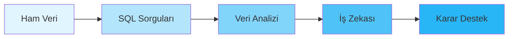
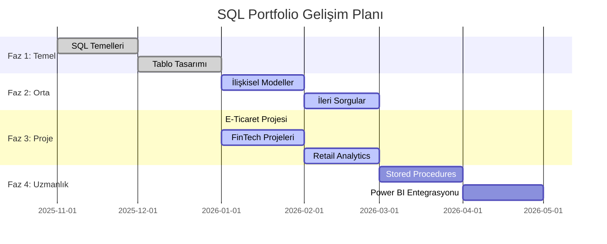

# 🚀 SQL Portfolio 2026

<div align="center">


**Endüstri Mühendisliği Bakış Açısıyla Veri Analizi ve Veritabanı Yönetimi**

[📊 Projeleri İncele](#-öne-çıkan-projeler) • [📜 Sertifikalar](#-sertifikalar--yetkinlikler) • [🛠️ Teknolojiler](#-teknoloji-yığını) • [📧 İletişim](https://www.linkedin.com/in/ibrahim-turkyilmaz-68a188253/)

</div>

---

## 📖 Portföy Hakkında

Bu depo, **Microsoft SQL Server (T-SQL)** ile gerçekleştirdiğim veri analizi projelerini, veritabanı tasarımlarını ve SQL yetkinliklerimi sergilemek amacıyla oluşturulmuştur.

### 🎯 Temel Odak Noktaları



| Odak Alanı | Açıklama |
|------------|----------|
| 🔍 **Veri Analizi** | Karmaşık veri setlerinden anlamlı içgörüler çıkarma |
| 💰 **Maliyet Optimizasyonu** | Karlılık ve zarar analizi, bütçe optimizasyonu |
| ⚙️ **Süreç İyileştirme** | İş süreçlerinin veritabanı üzerinden analizi ve iyileştirilmesi |
| 📊 **Karar Destek Sistemleri** | Yönetim kararlarını destekleyen analitik raporlar |

---

## 🏆 Sertifikalar & Yetkinlikler

<details>
<summary><b>📜 Sertifikalarım (Tıklayın)</b></summary>

### Resmi Sertifikalar

| Sertifika | Kurum | Tarih | Durum |
|-----------|-------|-------|-------|
| **Uygulamalarla SQL Öğreniyorum Eğitim Kampı** | BTK Akademi (Ömer Çolakoğlu) | Ocak 2026 | ✅ Tamamlandı |
| **SQL Server Fundamentals** | *(Planlanan)* | 2026 Q2 | 🔄 Devam Ediyor |

[📁 Sertifika Dosyalarını Görüntüle](./Eğitim%20Sertifikası/)

</details>

<details>
<summary><b>💻 Teknik Yetkinlikler (Tıklayın)</b></summary>

### SQL & Veritabanı

| Kategori | Teknolojiler | Seviye |
|----------|--------------|--------|
| **Veritabanı Tasarımı** | ER Modeling, Normalization (1NF-3NF), Schema Design | ⭐⭐⭐⭐⭐ |
| **T-SQL Temelleri** | SELECT, INSERT, UPDATE, DELETE, DDL, DML | ⭐⭐⭐⭐⭐ |
| **İleri SQL** | JOINs, Subqueries, CTEs, Window Functions | ⭐⭐⭐⭐⭐ |
| **Veri Bütünlüğü** | Constraints (PK, FK, CHECK), Indexes, Views | ⭐⭐⭐⭐ |
| **Performans** | Query Optimization, Execution Plans, Indexing | ⭐⭐⭐⭐ |
| **Programlama** | Stored Procedures, Functions, Triggers | ⭐⭐⭐ |

### Analiz & Araçlar

- **Veri Görselleştirme**: Power BI *(Geliştirme aşamasında)*
- **Versiyon Kontrol**: Git, GitHub
- **IDE**: SQL Server Management Studio (SSMS)
- **Diğer**: Excel (İleri Seviye), Python (Temel)

</details>

---

## 📂 Öne Çıkan Projeler

### 🗂️ Proje Kategorileri

```
SQL-Portfolio-2026/
│
├── 📁 Projeler_Sorguları_Scriptleri/    # Ana Proje Klasörü
│   ├── 🏪 Perakende-Store/              # E-Ticaret & Retail Analizleri
│   ├── 💳 FinTech & InsurTech/          # Finans & Sigorta Analitiği
│   └── 🚀 Ileri-Seviye/                 # İleri Seviye SQL Çalışmaları
│
├── 📁 Eğitim_Sorgularım_Scriptler/      # Eğitim & Alıştırma Scriptleri
└── 📁 Diyagram/                          # ER Diyagramları & Şemalar
```

---

### 🎯 Proje Portföy Özeti

<details>
<summary><b>🏪 1. E-Ticaret & Perakende Analizleri</b></summary>

#### 📦 E-Ticaret Veritabanı Mimarisi
**Durum:** ✅ **Tamamlandı**

Sıfırdan bir e-ticaret platformunun veritabanı altyapısının kurulması ve işletilmesi.

**Teknik Detaylar:**
- **Tablolar**: Müşteri, Sipariş, Ürün, Kategori, Stok, Ödeme
- **İlişkiler**: One-to-Many, Many-to-Many ilişkilendirmeler
- **Kısıtlamalar**: Primary Key, Foreign Key, CHECK, DEFAULT
- **Veri Seti**: SQL_Egitim_Kamp_TatilDE (Custom Dataset)

**Çözülen İş Problemleri:**
- ✅ Müşteri sipariş geçmişi analizi
- ✅ Stok yönetimi ve envanter kontrolü
- ✅ Ürün kategori bazlı performans raporlama

[📂 Detaylı İnceleme →](./Projeler_Sorguları_Scriptleri/Perakende-Store/)

---

#### 📉 Superstore Zarar Önleme Analizi
**Durum:** 🟡 **Geliştirme Aşamasında**

Global perakende veri seti üzerinde finansal kayıpların tespiti ve önleme stratejileri.

**Analiz Kapsamı:**
- Kar/zarar marjı hesaplamaları
- Bölgesel performans karşılaştırmaları
- Alt kategori bazlı karlılık analizi
- Müşteri segmentasyonu

**Kullanılan SQL Teknikleri:**
```sql
-- Örnek: Zarar Eden Kategorilerin Tespiti
WITH KategoriKarZarar AS (
    SELECT 
        Category,
        Sub_Category,
        SUM(Sales) AS ToplamSatis,
        SUM(Profit) AS ToplamKar,
        ROUND(SUM(Profit) / NULLIF(SUM(Sales), 0) * 100, 2) AS KarMarji
    FROM Superstore
    GROUP BY Category, Sub_Category
)
SELECT * FROM KategoriKarZarar
WHERE ToplamKar < 0
ORDER BY ToplamKar ASC;
```

[📂 Detaylı İnceleme →](./Projeler_Sorguları_Scriptleri/Perakende-Store/)

</details>

<details>
<summary><b>💳 2. FinTech & Sigorta Analitiği</b></summary>

#### 🏦 Bankacılık Analitiği
**Durum:** 🔄 **Aktif Geliştirme**

**Proje Kapsamı:**
- **Müşteri Terk (Churn) Analizi**: Bankadan ayrılan müşterilerin tahmin edilmesi
- **Kampanya Performansı**: Pazarlama kampanyalarının ROI analizi
- **Risk Skorlaması**: Kredi riski değerlendirme modelleri

**Veri Seti**: Bank Marketing Dataset (UCI)

**Örnek Analiz:**
```sql
-- Müşteri Terk Oranı Analizi
SELECT 
    Age_Group,
    COUNT(*) AS ToplamMusteri,
    SUM(CASE WHEN Exited = 1 THEN 1 ELSE 0 END) AS AyrilanMusteri,
    ROUND(SUM(CASE WHEN Exited = 1 THEN 1 ELSE 0 END) * 100.0 / COUNT(*), 2) AS TerkOrani
FROM CustomerChurn
GROUP BY Age_Group
ORDER BY TerkOrani DESC;
```

---

#### 🏥 Sigorta Analitiği
**Durum:** 🔄 **Aktif Geliştirme**

**Proje Kapsamı:**
- **Aktüeryal Fiyatlandırma**: Prim hesaplama modelleri
- **Fraud Detection**: Sahte hasar talebi tespiti
- **Risk Segmentasyonu**: Müşteri risk profilleme

**Veri Seti**: Insurance Claims Dataset

[📂 Detaylı İnceleme →](./Projeler_Sorguları_Scriptleri/FinTech%20%26%20InsurTech/)

</details>

<details>
<summary><b>🚀 3. İleri Seviye SQL Çalışmaları</b></summary>

#### 🎓 Konular
- **Window Functions**: ROW_NUMBER(), RANK(), DENSE_RANK(), NTILE()
- **Common Table Expressions (CTE)**: Recursive ve Non-Recursive CTE'ler
- **Pivot & Unpivot**: Dinamik veri dönüşümleri
- **Stored Procedures**: Parametreli prosedürler ve hata yönetimi
- **Triggers**: Insert, Update, Delete tetikleyicileri
- **Dynamic SQL**: Dinamik sorgu oluşturma teknikleri

#### 📊 Örnek Çalışmalar

**1. Recursive CTE ile Organizasyon Hiyerarşisi**
```sql
WITH CalisanHiyerarsi AS (
    -- Anchor: En üst seviye yöneticiler
    SELECT 
        EmployeeID,
        EmployeeName,
        ManagerID,
        1 AS Seviye
    FROM Employees
    WHERE ManagerID IS NULL
    
    UNION ALL
    
    -- Recursive: Alt seviye çalışanlar
    SELECT 
        e.EmployeeID,
        e.EmployeeName,
        e.ManagerID,
        ch.Seviye + 1
    FROM Employees e
    INNER JOIN CalisanHiyerarsi ch ON e.ManagerID = ch.EmployeeID
)
SELECT * FROM CalisanHiyerarsi
ORDER BY Seviye, EmployeeName;
```

**2. Window Function ile Satış Analizi**
```sql
SELECT 
    SalesDate,
    Product,
    SalesAmount,
    -- Hareketli ortalama (Son 3 gün)
    AVG(SalesAmount) OVER (
        PARTITION BY Product 
        ORDER BY SalesDate 
        ROWS BETWEEN 2 PRECEDING AND CURRENT ROW
    ) AS HareketliOrtalama,
    -- Kümülatif toplam
    SUM(SalesAmount) OVER (
        PARTITION BY Product 
        ORDER BY SalesDate
    ) AS KumulatifToplam,
    -- Sıralama
    ROW_NUMBER() OVER (
        PARTITION BY Product 
        ORDER BY SalesAmount DESC
    ) AS SatisRank
FROM Sales;
```

[📂 Detaylı İnceleme →](./Projeler_Sorguları_Scriptleri/Ileri-Seviye/)

</details>

---

## 🛠️ Teknoloji Yığını

<div align="center">

### Ana Teknolojiler


### Araçlar & Platformlar


</div>

| Kategori | Araçlar | Amaç |
|----------|---------|------|
| **Veritabanı** | Microsoft SQL Server 2019/2022 | Ana veritabanı yönetim sistemi |
| **IDE** | SQL Server Management Studio (SSMS) | Sorgu geliştirme ve yönetim |
| **Versiyon Kontrol** | Git, GitHub Desktop | Kod versiyonlama ve işbirliği |
| **Veri Görselleştirme** | Power BI (Planlanan) | Dashboard ve raporlama |
| **Diyagram** | dbdiagram.io, Draw.io | ER diyagramları ve şema tasarımı |

---

## 📈 Gelişim Yol Haritası



### 🎯 Kilometre Taşları

| Faz | Odak | Durum | Tamamlanma |
|-----|------|-------|------------|
| **Faz 1** | SQL Temelleri & Tablo Tasarımı | ✅ Tamamlandı | %100 |
| **Faz 2** | İlişkisel Modeller & İleri Sorgular | 🔄 Devam Ediyor | %75 |
| **Faz 3** | Gerçek Veri Setleri ile Projeler | 🔄 Devam Ediyor | %60 |
| **Faz 4** | Power BI & Dashboard Geliştirme | 📅 Planlanan | %0 |

<details>
<summary><b>📅 Detaylı Planlama (Tıklayın)</b></summary>

### 2026 Q1 (Ocak - Mart)
- [x] BTK Akademi SQL Eğitimi Tamamlama
- [x] E-Ticaret Veritabanı Mimarisi
- [ ] Superstore Analizi Tamamlama
- [ ] FinTech Churn Analizi

### 2026 Q2 (Nisan - Haziran)
- [ ] Stored Procedures & Triggers Mastery
- [ ] Power BI Dashboard Projesi
- [ ] SQL Server Certification Sınavı

### 2026 Q3 (Temmuz - Eylül)
- [ ] Advanced Performance Tuning
- [ ] Real-time Data Processing Projesi
- [ ] Portfolio Web Sitesi

</details>

---

## 📊 Proje İstatistikleri

<div align="center">

| Metrik | Değer |
|--------|-------|
| **Toplam Proje** | 🔢 8 |
| **Tamamlanan** | ✅ 3 |
| **Devam Eden** | 🔄 5 |
| **Toplam SQL Script** | 📝 50+ |
| **Kod Satırı** | 💻 2,500+ |
| **Veri Seti** | 📊 6 |

</div>

---

## 📚 Veri Setleri

| Veri Seti | Kaynak | Kullanıldığı Proje | Boyut |
|-----------|--------|-------------------|-------|
| **SQL_Egitim_Kamp_TatilDE** | Custom Dataset | E-Ticaret Mimarisi | ~1K rows |
| **Superstore Sales** | Kaggle | Retail Analizi | ~10K rows |
| **Bank Marketing** | UCI ML Repository | FinTech Churn | ~45K rows |
| **Insurance Claims** | Kaggle | InsurTech Fraud | ~20K rows |

---

## 💡 Öne Çıkan SQL Teknikleri

<details>
<summary><b>🔍 Complex JOINs & Subqueries</b></summary>

```sql
-- Örnek: Müşteri Yaşam Boyu Değeri (Customer Lifetime Value)
SELECT 
    c.CustomerID,
    c.CustomerName,
    COUNT(DISTINCT o.OrderID) AS ToplamSiparis,
    SUM(od.Quantity * od.UnitPrice) AS ToplamHarcama,
    -- İlk ve son sipariş tarihi
    MIN(o.OrderDate) AS IlkSiparis,
    MAX(o.OrderDate) AS SonSiparis,
    -- Ortalama sipariş değeri
    AVG(od.Quantity * od.UnitPrice) AS OrtSiparisDeğeri
FROM Customers c
LEFT JOIN Orders o ON c.CustomerID = o.CustomerID
LEFT JOIN OrderDetails od ON o.OrderID = od.OrderID
WHERE o.OrderDate >= DATEADD(YEAR, -1, GETDATE())
GROUP BY c.CustomerID, c.CustomerName
HAVING COUNT(DISTINCT o.OrderID) > 5
ORDER BY ToplamHarcama DESC;
```

</details>

<details>
<summary><b>📊 Window Functions & Analytics</b></summary>

```sql
-- Örnek: Satış Trendi ve Yüzdesel Değişim
WITH SatisAnaliz AS (
    SELECT 
        YEAR(OrderDate) AS Yil,
        MONTH(OrderDate) AS Ay,
        SUM(TotalAmount) AS AylikSatis,
        -- Bir önceki ay
        LAG(SUM(TotalAmount)) OVER (ORDER BY YEAR(OrderDate), MONTH(OrderDate)) AS OncekiAy,
        -- Hareketli ortalama (3 ay)
        AVG(SUM(TotalAmount)) OVER (
            ORDER BY YEAR(OrderDate), MONTH(OrderDate) 
            ROWS BETWEEN 2 PRECEDING AND CURRENT ROW
        ) AS HareketliOrt3Ay
    FROM Orders
    GROUP BY YEAR(OrderDate), MONTH(OrderDate)
)
SELECT 
    *,
    -- Yüzdesel değişim
    ROUND((AylikSatis - OncekiAy) / NULLIF(OncekiAy, 0) * 100, 2) AS DegisimYuzde
FROM SatisAnaliz
ORDER BY Yil, Ay;
```

</details>

<details>
<summary><b>🔄 Dynamic SQL & Automation</b></summary>

```sql
-- Örnek: Dinamik Pivot Table Oluşturma
DECLARE @Kolonlar NVARCHAR(MAX)
DECLARE @SQL NVARCHAR(MAX)

-- Dinamik sütun listesi oluştur
SELECT @Kolonlar = STRING_AGG(QUOTENAME(Category), ', ')
FROM (SELECT DISTINCT Category FROM Products) AS Categories;

-- Dinamik pivot sorgusu
SET @SQL = '
SELECT *
FROM (
    SELECT 
        YEAR(OrderDate) AS Yil,
        Category,
        SUM(Quantity) AS Miktar
    FROM Orders o
    JOIN OrderDetails od ON o.OrderID = od.OrderID
    JOIN Products p ON od.ProductID = p.ProductID
    GROUP BY YEAR(OrderDate), Category
) AS SourceTable
PIVOT (
    SUM(Miktar)
    FOR Category IN (' + @Kolonlar + ')
) AS PivotTable
ORDER BY Yil;'

EXEC sp_executesql @SQL;
```

</details>

---

## 🎓 Öğrenme Kaynakları

### Kullandığım Kaynaklar

| Kaynak | Tür | Link |
|--------|-----|------|
| **BTK Akademi - Uygulamalarla SQL** | Video Kurs | [Link](https://www.btkakademi.gov.tr/) |
| **Microsoft SQL Server Docs** | Dokümantasyon | [Link](https://docs.microsoft.com/sql/) |
| **Mode Analytics SQL Tutorial** | İnteraktif | [Link](https://mode.com/sql-tutorial/) |
| **SQLZoo** | Pratik | [Link](https://sqlzoo.net/) |

---

## 📞 İletişim & Bağlantılar

<div align="center">

[](https://www.linkedin.com/in/ibrahim-turkyilmaz-68a188253/)
[](https://github.com/ibrahimturkyilmaz)
[](mailto:your.email@example.com)

</div>

---

## 📄 Lisans

Bu proje [MIT Lisansı](LICENSE) altında lisanslanmıştır.

---

<div align="center">

### ⭐ Bu projeyi beğendiyseniz yıldız vermeyi unutmayın!

**Son Güncelleme:** Şubat 2026

*Endüstri Mühendisliği × Veri Bilimi × SQL*

</div>
